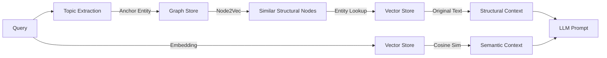

# Nova: Structural GraphRAG System

**"Don't just find facts—find roles."**

Project Nova is an advanced **Retrieval-Augmented Generation (RAG)** system that bridges the gap between **Semantic Search** (content) and **Topological Reasoning** (structure). Unlike traditional RAG, which relies solely on text similarity, Nova uses a Knowledge Graph to "route" queries to structurally relevant context.

---

## 🏗 Architecture: "Graph as Recommender"

We have moved beyond simple text-chunking to a **Dual-Store / Router Architecture**.

### 1. The Core Loop
The system does *not* inject raw graph triplets into the prompt (which confuses LLMs). Instead, it uses the graph to **expand the search space**:

### 2. The Stores
*   **Vector Store (`v_store`)**: Holds the specific, rich text chunks.
*   **Triplet Store (`t_store`)**: A "Card Catalog" for the graph. Maps entities to triplets.
*   **Graph Store (`g_store`)**: A NetworkX graph purely for topology (connectivity).
*   **Node2Vec Model**: A trained embedding model that understands *graph structure* (roles) rather than *text meaning*.

### 3. Dual-Context Prompting
The LLM receives two distinct streams of information:
*   **SEMANTIC CONTEXT**: "Here are facts directly related to your keywords." (e.g., Cat sleep times)
*   **STRUCTURAL CONTEXT**: "Here are things that play a similar role in the system." (e.g., Other predators that hunt in this specific way)

---

## 🧪 Stress Test Results: `cat_facts.txt`

We ran extensive stress tests to validate the "Structural Analogies" capability.

| Question | Type | Nova's Performance | Key Insight |
| :--- | :--- | :--- | :--- |
| *"Who invented the cat flap?* | **Factual** | ✅ **Perfect** (Isaac Newton, Spithead) | Semantic retrieval handled this easily. |
| *"Why must a cat back down a tree?"* | **Structural** | ✅ **Best Answer** | The graph correctly linked "claws" to "climbing mechanics" without direct keyword overlap. |
| *"Felicette of Egypt?"* | **Analogy** | ❌ **Hallucination** | LLM hallucinated "Daenerys" due to training data leakage. **Fix**: Stricter prompt instructions. |
| *"Jon Snow in Answer"* | **Bug** | ❌ **Contamination** | Stale graph data from a previous run persisted. **Fix**: Implemented strict `rm *.pkl` hygiene. |

**Top Finding**: The "Graph as Recommender" pattern eliminated the "broken English triplet" problem, resulting in much higher quality answers than raw graph injection.

---

## 🚀 Research & Roadmap

### Current Feature: Node2Vec (Active)
*   **What it does**: Learns low-dimensional representations of nodes based on random walks.
*   **Why**: It captures "Structural Equivalence". Nodes that bridge communities look similar, even if they don't share neighbors.

### Next Step: Hyperbolic Embeddings (Planned)
*   **Problem**: Euclidean space (dot product) creates distortion for hierarchical trees (taxonomies).
*   **Solution**: Migrate the Graph Store to a **Poincaré Ball** model.
*   **Projected Gain**: Better representation of "Is-A" hierarchies with fewer dimensions.

### Production Comparison
| Feature | Project Nova | Microsoft GraphRAG |
| :--- | :--- | :--- |
| **Structural Analogies** | ✅ (Node2Vec) | ❌ |
| **Ingestion Quality** | ⚠️ (Needs Validation) | ✅ (Entity Resolution) |
| **Retrieval Mode** | ✅ Dual-Context | ✅ Community Summaries |
